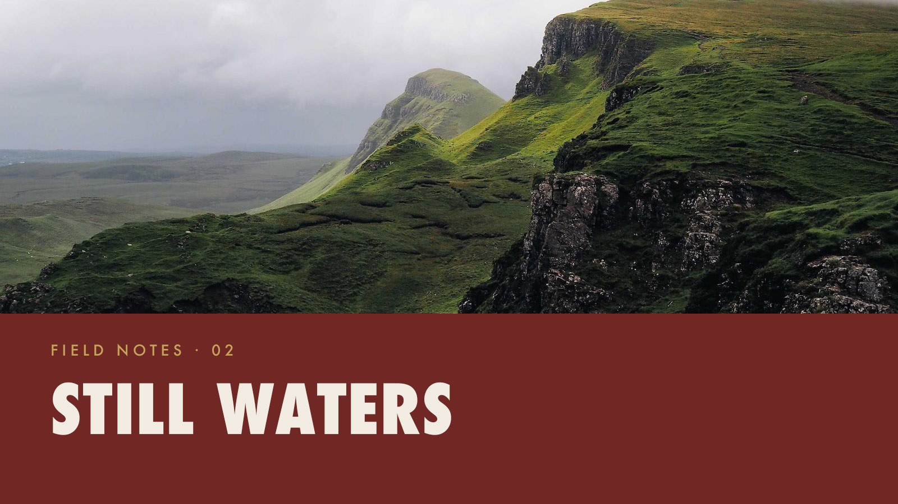
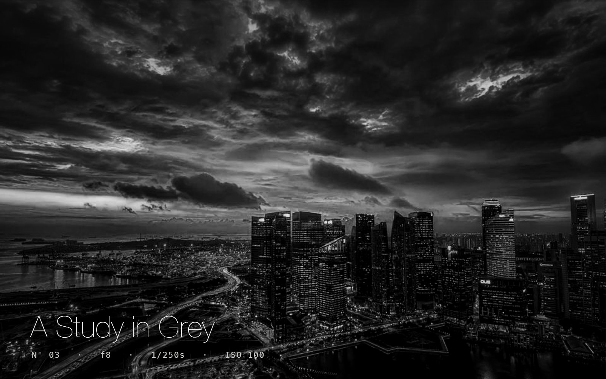

# photoshop-uxp

An [Agent Skill](https://docs.anthropic.com/en/docs/agents) for driving Adobe Photoshop programmatically via [UXP scripting](https://developer.adobe.com/photoshop/uxp/) — `.psjs` scripts using the Photoshop DOM and `batchPlay`.

It equips an AI agent to generate, edit, retouch, grade, and inspect Photoshop documents, and to **read its own output back** (a rendered preview + a document state file) so it can verify and correct its work instead of editing blind.

## What it covers

- **Documents & layers** — create, open, layers, groups, text, smart objects, ordering, transforms.
- **Fills & backgrounds** — solid and gradient fill layers, region masking via selections.
- **Image placement** — place external files as smart objects, scale-to-cover/fit, recenter.
- **Non-destructive grading** — Black & White, Curves, levels, hue/sat, vignette and other adjustment layers.
- **Selections & masks** — rectangles, compound shapes, layer masks, local edits.
- **Type** — multi-line text, explicit font / size / tracking / color (none are inherited by default).
- **Result readback** — emit `preview.jpg` + `state.json` so the agent can see what it made.
- **Running & triggering** — how `.psjs` scripts execute, and how to launch them without manual clicks.

Photoshop only. Lightroom uses a different stack.

## Gallery

Real Photoshop renders produced by the scripts in [`examples/`](examples/), each in a different design language to show the range:

| Editorial serif | Bold geometric | Cinematic B&W |
|---|---|---|
|  |  |  |
| generate from nothing | place + cover a photo | non-destructive grade |

## Install

Via [skills.sh](https://skills.sh) / the `skills` CLI:

```bash
npx skills add LissaGreense/photoshop-uxp
```

Or install manually — drop the `photoshop-uxp/` directory into your agent's skills folder (e.g. `.claude/skills/`), or use the packaged `photoshop-uxp.skill`. The agent reads `SKILL.md` first, then loads the reference files as a task requires.

## Layout

```
photoshop-uxp/
├── SKILL.md                          # entry point: API model, workflow, intent routing, sizing
├── assets/
│   └── harness.psjs                  # copy-paste preamble: batchPlay wrapper + result readback
├── references/
│   ├── layers-and-composition.md     # layers, text, fills, image placement, adjustments, selections, masks
│   ├── batchplay.md                  # descriptor anatomy, capturing & reading descriptors
│   ├── reading-results.md            # preview.jpg + state.json, locating output on disk
│   ├── running-scripts.md            # script vs plugin, triggering execution
│   └── gotchas.md                    # modal scope, units, history, async, networking
└── evals/
    └── evals.json                    # rendered-output test cases

examples/                             # runnable scripts + their committed renders
photoshop-uxp.skill                   # packaged artifact
```

## How it works

`.psjs` scripts run **already modal** — they call the DOM and `batchPlay` directly (no `executeAsModal`, which is plugin-only). A script can't return stdout to the caller, so it writes `preview.jpg` (a flattened render) and `state.json` (the layer tree, sizes, and any errors) to Photoshop's temp folder; the agent locates the newest output by modification time and inspects it.

The skill's central rule: **`errors: []` does not mean correct.** A call can succeed and change nothing, so non-trivial work runs as a loop — edit, render, look at the preview, adjust. The skill also distinguishes operating on a document you created (close it when done) from a document the user already had open (edit non-destructively, keep it undoable, never overwrite it).

## Requirements

- Adobe Photoshop 23.5 or newer, already running.
- The trigger examples use macOS `open -a`; the scripts themselves are cross-platform — only the launch command differs on Windows.
